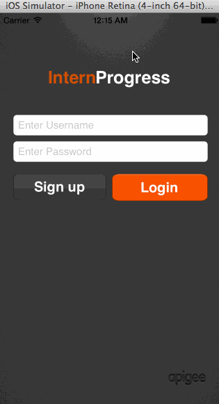

About the app
=============
This is an iOS app to be used by the mentors and interns during internship. It lets the mentor and intern share a progress 
report based on the daily progress added by the intern. The intern can manage the mentors with whom he wants to share his progress. The mentor can view the progress reports of all interns working under him. 
This app uses Apigee's App Services, which is a free hosted version of the open source BaaS project called Usergrid. 

Using the app
=============
Clone the repository into your computer. Open the file Intern Progress.xcodeproj in Xcode and run the project.
To try out the app, you can use the following demo users:

	username: intern@demo.com
	password: interndemo

	username: mentor@demo.com
	password: mentordemo
  
You can also register as a new user.

Walkthrough of all user stories:

GIF created with [LiceCap](http://www.cockos.com/licecap/).
